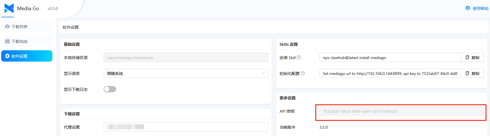
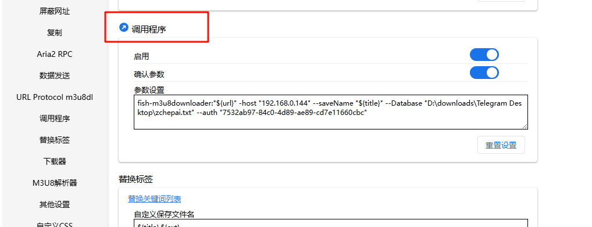

#### 猫抓设置

这个程序是用来下载h篇.

所以做了一些自定义操作.

比如 `--DataBase "一个txt文件路径" `  这里每行都是一个番号.


#### 使用教程

1.先使用 `FishM3u8Downloader.exe --register`在windows电脑上注册协议

```
fish-m3u8downloader:<视频地址> -host <IP> --saveName <文件名> --Database <数据库txt路径>

示例：
  fish-m3u8downloader:https://example.com/video.m3u8 -host 192.168.0.144 --saveName "STARS-435 测试" --Database "D:\downloads\zchepai.txt"

注册协议: FishM3u8Downloader.exe --register
注销协议: FishM3u8Downloader.exe --unregister
```


2.Media Go `软件设置`复制密钥 贴到猫抓



3.猫抓 `调用程序`   192.168.0.144是 Media Go部署的服务端.连接端口:8899(程序内固定)




#### 提醒

程序仅供参考.建议下载后自己改改